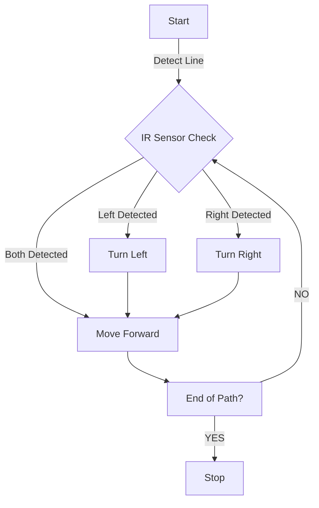
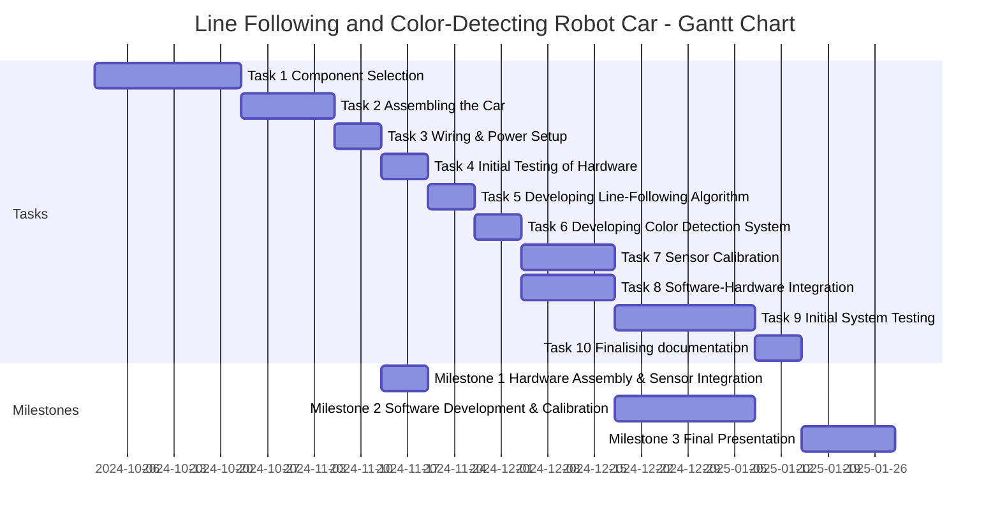

# Line Following and Color-Detecting Robot Car - Project Report
## Project Evaluation
### Introduction
The Line Following and Color-Detecting Robot Car is an autonomous vehicle powered by Raspberry Pi that follows a predefined path and changes direction based on the color of the line beneath it. This project demonstrates real-time sensor integration and motor control for practical applications in automation and robotics. The goal is to enhance efficiency and accuracy in industries such as manufacturing, logistics, and warehousing by automating material transport along predefined paths.

### State-of-the-Art Overview
The state-of-the-art in this field includes various line-following robots that use infrared sensors to follow a path. Some of the robots found that actively detect the line's color use either just an RGB sensor in order to follow a line, or more advanced designs such as camera with implementing computer vision to detect the line and its color. Both of the solutions have their flaws, such as randomness when the line disappears, and we wanted to combine them in a way that will prevent these flaws from happenning in order to enhance them.

## Solution
### Idea of the Solution
The solution involves using the Wave Rover chassis equipped with infrared and color sensors to follow a line and detect its color. The system is composed of several components:
- **Hardware**:
  - **Wave Rover chassis**: The physical robot where the system is set up, meant to look similar to a car for convenience.
  - **Raspberry Pi Zero 2**: Microcontroller board used to control the robot based on received sensor data.
  - **ESP32**: Communication between the RPi and the motors, in order to control the robot.
  - **Infrared sensors**: Detect the line on the surface, enabling the robot to stay on it.
  - **Color sensor**: Detect the color underneath the robot, meant to be used for color recognition to choose the specific line to follow.
  - **Motors and wheels**: Used for movement, controlled by the ESP32
- **Software**:
  - **Python (version 3.x)**: The primary programming language used for developing the control algorithms and communication protocols.
  - **RPi.GPIO (version 0.7.0)**: A Python library used to control the GPIO pins on the Raspberry Pi, enabling interaction with the sensors and motors.
  - **pySerial (version 3.5)**: A Python library used for serial communication between the Raspberry Pi and the ESP32, allowing the exchange of JSON commands.
  - **argparse (standard library)**: A Python module used for parsing command-line arguments, making it easier to run the serial communication script with different port configurations.
  - **threading (standard library)**: A Python module used to handle concurrent execution of tasks, such as reading from the serial port while sending commands.
  - **Flask**: To create a lightweight web interface for controlling the robot.
  - **time**: To introduce delays in the program execution
  
### Details of the Solution
The robot uses infrared sensors to detect and follow a line and color sensor to detect its color. The data from the sensors is processed by the Raspberry Pi, which communicates with the ESP32 to control the motors and adjust the robot's path. While the line following done by controlling the robot based on infrared sensors' output works without any problems, resulting in a very good line follower, the color sensor introduced problems mainly in the communication, which means the color detection doesn't work correctly unfortunately, resulting in only a regular line follower. The problems with I2C communication with the color sensor could be caused by low quality of the sensor itself, the cabling or ports, but since we have tried multiple times to change the cabling, disconnect and connect everything again, we concluded that the problem is either in the sensor itself, or is caused by the interference caused by too many wires being in one place. Since we didn't find out for sure the cause of these problems, we couldn't adjust the system properly, which meant we had to downgrade to a regular line follower. The logic performed by the software part python on Raspberry to communicate with ESP32 to parse built-in robot commands to control speed of the wheels. The most important part of the code - the main loop - checks for the line beneath both of IR sensors, going straight when both or none of IR sensors detect the line, and when only one of them does, the speed is adjusted so that the robot turns in the direction of the line. Diagram of the system:



Most of the communication between RPi and ESP32 is made according to instruction provided by the Waveshare website, along with ESP32 configuration and robot control basics. When the robot is turned on, RPi connects to the Wi-Fi that needs to be previously set up, and we also connect a device to the same Wi-Fi to SSH into the RPi, allowing us to turn on the code with the application where we can then control turning-on and -off the system. When turned ON, the application starts the communication with ESP32 to control the robot. To issue JSON commands using GPIO or USB serial port, the following methods can be used:
- **UART Interface**: Connect the robot to the Raspberry Pi, Jetson Nano, or Jetson Orin Nano via a 40PIN UART interface.
- **USB Connection**: Connect the USB port of the robot's slave drive board to the host via a USB cable (this method requires disassembly of the robot).
  

In our project, we used the UART interface to establish communication between the Raspberry Pi and the ESP32. A Python script (`bang_bang_control.py`) is used for serial communication, allowing the host to send commands to the robot and receive data. For example, the following command can be used to control the speed of the left and right wheels:

```json
{"T":1,"L":0.5,"R":0.5}
```
L is the speed of the left wheel, R is the speed of the right wheel, and the speed range is -0.5 ~ +0.5, positive value forward, negative value backward.
### Code Overview

The WaveRover Robot Control System is structured to handle hardware communication, robot navigation, and a user-friendly web interface. The pseudo-code of the system:
```python
while True:
    left_ir = GPIO.input(LEFT_IR_PIN)
    right_ir = GPIO.input(RIGHT_IR_PIN)
    if left_ir == 1 and right_ir == 1:
        move_forward()
    elif left_ir == 0 and right_ir == 1:
        turn_left()
    elif left_ir == 1 and right_ir == 0:
        turn_right()
    else:
        move_forward()
```

**1. Main Function: `main()`**

The `main()` function is the program's entry point. It initializes all key components and starts the web server and threads required for concurrent execution.

 **Code Snippet**
```python
def main():
    global line_following_active
    parser = argparse.ArgumentParser(description="WaveRover Web Control")
    parser.add_argument('port', type=str, help='Serial port name (e.g., /dev/ttyUSB0)')
    args = parser.parse_args()
    ser = serial.Serial(args.port, baudrate=115200, dsrdtr=None)
    ser.setRTS(False)
    ser.setDTR(False)
    setup_gpio()
    serial_thread = threading.Thread(target=read_serial, args=(ser,), daemon=True)
    serial_thread.start()
    line_follow_thread = threading.Thread(target=bang_bang_line_follow, args=(ser,), daemon=True)
    line_follow_thread.start()
    try:
        app.run(host='0.0.0.0', port=5000, debug=False)
    except KeyboardInterrupt:
        pass
    finally:
        ser.close()
        GPIO.cleanup()
```

 **Explanation**
- **Command-Line Argument Parsing**:
  - `parser.add_argument('port')`: Accepts the serial port name (e.g., `/dev/serial0`) as an argument to connect to the ESP32.
  - `args = parser.parse_args()`: Parses the provided port argument at runtime.

- **Serial Communication**:
  - `ser = serial.Serial(args.port, baudrate=115200)`: Opens a connection to the ESP32 with a baud rate of `115200`.
  - `ser.setRTS(False)` and `ser.setDTR(False)`: Ensures serial communication stability by disabling unnecessary control signals.

- **GPIO Setup**:
  - Calls `setup_gpio()` to initialize GPIO pins for the IR sensors.

- **Thread Initialization**:
  - **Serial Thread**:
    - Runs `read_serial()` to handle incoming data from the ESP32.
  - **Line-Follow Thread**:
    - Runs `bang_bang_line_follow()` to implement the robot's line-following behavior.

- **Web Server**:
  - `app.run()`: Starts the Flask web server at `http://<raspberry-pi-ip>:5000`.

- **Cleanup**:
  - Ensures proper resource cleanup (`ser.close()` and `GPIO.cleanup()`) when the program exits.


 **2. GPIO Setup: `setup_gpio()`**

This function configures the Raspberry Pi's GPIO pins for reading IR sensor input.

### **Code Snippet**
```python
def setup_gpio():
    GPIO.setmode(GPIO.BCM)
    GPIO.setup(LEFT_IR_PIN, GPIO.IN)
    GPIO.setup(RIGHT_IR_PIN, GPIO.IN)
```

**Explanation**
- **GPIO Mode**:
  - `GPIO.setmode(GPIO.BCM)`: Uses Broadcom (BCM) numbering for GPIO pins.
- **Pin Setup**:
  - `GPIO.setup(pin, GPIO.IN)`: Configures `LEFT_IR_PIN` and `RIGHT_IR_PIN` as input pins for the IR sensors.


**3. Line-Following Logic: `bang_bang_line_follow()`**

This function handles the robot's movement using Bang-Bang control. It continuously reads IR sensor input and sends appropriate motor commands to the ESP32.

 **Code Snippet**
```python
def bang_bang_line_follow(ser):
    while True:
        if line_following_active:
            left_ir = GPIO.input(LEFT_IR_PIN)
            right_ir = GPIO.input(RIGHT_IR_PIN)
            if left_ir == 1 and right_ir == 1:
                forward_command = {"T": 1, "L": 0.1, "R": 0.1}
            elif left_ir == 0 and right_ir == 1:
                forward_command = {"T": 1, "L": 0.5, "R": -0.5}
            elif left_ir == 1 and right_ir == 0:
                forward_command = {"T": 1, "L": -0.5, "R": 0.5}
            else:
                forward_command = {"T": 1, "L": 0.08, "R": 0.08}
            ser.write((str(forward_command).replace("'", "\"") + "\n").encode())
        else:
            stop_command = {"T": 1, "L": 0, "R": 0}
            ser.write((str(stop_command).replace("'", "\"") + "\n").encode())
        time.sleep(0.05)
```

**Explanation**
- **Sensor Input**:
  - Reads IR sensor values using `GPIO.input()` to determine the robot's position relative to the line.
- **Bang-Bang Control Logic**:
  - Adjusts motor speeds based on sensor input:
    - **Both Sensors Detect the Line**: Move forward.
    - **Only Left Sensor Detects the Line**: Turn left.
    - **Only Right Sensor Detects the Line**: Turn right.
    - **No Sensors Detect the Line**: Adjust forward slightly.
- **Command Format**:
  - Sends JSON-like commands (`{"T": mode, "L": left_motor_speed, "R": right_motor_speed}`) to the ESP32 over the serial port.
  - "T":1 is used for accurate speed control
- **Stop Command**:
  - Stops the robot when `line_following_active` is `False`.


 **4. Serial Communication: `read_serial()`**

This function continuously reads messages from the ESP32 and logs them to the console.

 **Code Snippet**
```python
def read_serial(ser):
    while True:
        data = ser.readline().decode("utf-8").strip()
        if data:
            print(f"ESP32 says: {data}", end="")
```

**Explanation**
- **Serial Read**:
  - Reads a line of data from the serial port using `ser.readline()`.
- **Data Processing**:
  - Decodes the data to a UTF-8 string and removes trailing whitespace.
- **Logging**:
  - Prints the received message to the console for monitoring.


 **5. Flask Web Interface**

 **Flask Route: Web Interface for WaveRover Control**

The `index()` function defines the main route (`/`) of the Flask application. It serves an interactive web page to control the WaveRover robot.


 **HTML Code**

```python
@app.route('/', methods=['GET'])
def index():
    return """
    <html>
    <head>
        <title>WaveRover Control</title>
        ...
    </head>
    <body>
        ...
    </body>
    </html>
    """
```

 **Explanation**
1. **Route Definition**:
   - `@app.route('/', methods=['GET'])`: Defines the root URL (`/`) of the web application and associates it with the `index()` function. This route responds to `GET` requests.
   
2. **HTML Structure**:
   - The HTML returned by the `index()` function contains:
     - A `<head>` section for metadata, styling (CSS), and JavaScript.
     - A `<body>` section for the visible content and controls (buttons and status display).


 **Head Section**
 **Title**
```html
<title>WaveRover Control</title>
```
- Sets the title of the web page, displayed in the browser's tab.

 **CSS Styling**
```html
<style>
    body {
        font-family: Arial, sans-serif;
        background-color: #f4f4f9;
        ...
    }
</style>
```
**CSS Explanation**
1. **Body Styling**:
   - `font-family`: Sets the font to Arial for a clean look.
   - `background-color`: Applies a light gray background for better visibility.
   - `display: flex`: Uses Flexbox to center the content vertically and horizontally.
   - `height: 100vh`: Ensures the layout spans the full height of the browser window.

2. **Header (`<h1>`) Styling**:
   ```css
   h1 {
       margin-bottom: 20px;
   }
   ```
   - Adds space below the header for a clean layout.

3. **Button Container**:
   ```css
   .button-container {
       display: flex;
       gap: 20px;
       margin-bottom: 20px;
   }
   ```
   - Aligns the buttons horizontally using Flexbox.
   - Adds spacing (`gap: 20px`) between buttons.

4. **Button Styling**:
   ```css
   button {
       padding: 15px 30px;
       font-size: 16px;
       color: #fff;
       background-color: #007BFF;
       border: none;
       border-radius: 5px;
       cursor: pointer;
       transition: background-color 0.3s ease;
   }
   ```
   - Buttons are styled with a blue background, white text, rounded corners, and a hover effect.
   - **Hover and Active Effects**:
     ```css
     button:hover {
         background-color: #0056b3;
     }
     button:active {
         transform: scale(0.98);
     }
     ```
     - On hover, the button's background changes to a darker blue.
     - On click, the button slightly shrinks for visual feedback.

5. **Status Text**:
   ```css
   #status {
       font-size: 18px;
       font-weight: bold;
       margin-top: 10px;
       color: #007BFF;
   }
   ```
   - Displays the status message in blue, bold text below the buttons.


 **JavaScript Code**

```html
<script>
    function sendCommand(url) {
        fetch(url, { method: 'POST' })
            .then(response => response.text())
            .then(data => {
                document.getElementById("status").innerText = data;
            })
            .catch(error => {
                console.error('Error:', error);
                document.getElementById("status").innerText = "Error: Unable to connect to the server.";
            });
    }
</script>
```

 **JavaScript Explanation**
1. **Purpose**:
   - The `sendCommand` function handles button clicks and sends requests to the server without refreshing the page.

2. **Functionality**:
   - **`fetch(url, { method: 'POST' })`**:
     - Sends a `POST` request to the specified URL (`/start` or `/stop`).
   - **`.then(response => response.text())`**:
     - Processes the server's response and converts it to plain text.
   - **`.then(data => { ... })`**:
     - Updates the status message on the page with the server's response (e.g., "Line following started.").
   - **`.catch(error => { ... })`**:
     - Logs errors to the browser console and displays an error message on the page.


 **Body Section**

```html
<body>
    <h1>WaveRover Control Panel</h1>
    <div class="button-container">
        <button onclick="sendCommand('/start')">Start Line Following</button>
        <button onclick="sendCommand('/stop')">Stop Line Following</button>
    </div>
    <p id="status"></p>
</body>
```

 **Explanation**
1. **Header**:
   ```html
   <h1>WaveRover Control Panel</h1>
   ```
   - Displays the title of the control panel.

2. **Button Container**:
   ```html
   <div class="button-container">
       <button onclick="sendCommand('/start')">Start Line Following</button>
       <button onclick="sendCommand('/stop')">Stop Line Following</button>
   </div>
   ```
   - Contains two buttons:
     - **Start Button**:
       - Sends a `POST` request to `/start` to activate line-following mode.
     - **Stop Button**:
       - Sends a `POST` request to `/stop` to deactivate line-following mode.

3. **Status Message**:
   ```html
   <p id="status"></p>
   ```
   - Displays the server's response or error messages dynamically.
   - Initially empty, updated by the `sendCommand` function.


**How It Works**

1. When the page loads, the user sees two buttons: "Start Line Following" and "Stop Line Following."
2. Clicking a button triggers the `sendCommand` function, which:
   - Sends a `POST` request to the server (`/start` or `/stop`).
   - Updates the `<p>` element with the server's response (e.g., "Line following started.").
3. The page does not reload, providing a seamless user experience.


**Start and Stop Routes**
```python
@app.route('/start', methods=['POST'])
def start_line_follow():
    global line_following_active
    line_following_active = True
    return "Line following started."

@app.route('/stop', methods=['POST'])
def stop_line_follow():
    global line_following_active
    line_following_active = False
    return "Line following stopped."
```

- **Start Route (`/start`)**:
  - Activates the line-following functionality.
- **Stop Route (`/stop`)**:
  - Deactivates the line-following functionality.


 **6. Cleanup**

Ensures proper resource cleanup when the program is terminated.
 **Code Snippet**
```python
finally:
    ser.close()
    GPIO.cleanup()
```

**Explanation**
- **Serial Close**:
  - Closes the serial connection to free the port for other processes.
- **GPIO Cleanup**:
  - Resets GPIO pins to avoid warnings or conflicts during subsequent runs.

### Tests and Results
The first round of testing focused on the hardware testing, specifically sensor testing. Basic functionality programs were implemented to print the result of IR sensor (1 or 0), which was also visible by the LEDs included in IR sensor, which allowed us to see the sensor response to different types of objects. We have concluded that the IR sensor cannot detect the line that is not black (or white) which meant we had to think hard about the logic in the software or the path itself to adjust to robot's design. Then color sensor was tested to print R, G, B values detected, and while the sensor doesn't work when we connected the full setup, it worked while testing, and we could notice that the results varied depending on ambient light, but overall were accurately describing the color that we wanted to check. Then we tested the movement of the wheels and the response from the IR sensors to make sure they worked as expected. The second round of testing involved setting up the robot's environment with white paper and black tape. During this phase, the robot successfully followed the black line without using the RGB sensor. The third phase of testing added the RGB sensor to detect and respond to different colors on the surface, where previously mentioned problems with I2C communication rose again, and after some tries we still couldn't find what the problem with RGB sensor is, and how to fix it, resulting in our inability to introduce color detection logic to the robot, leaving us with just the line follower.

As for the test conditions, we tried testing the system on various floors, and unless the floor contains black spots the system works perfectly. While testing the system, we have found out that IR sensors can easily de-adjust during transportation, and they have to be re-adjusted after moving the robot to a different place. We tested the system with various lighting conditions, and they seem to not have any influence on the system since there is an LED on the bottom of RGB sensor lighting the floor at all times. Because of how the IR checking is performed, and low speed that we use, the system works both on very thick and thin lines of tape used for testing. The system also worked well whether we used reflecting tape or matte tape. We tested the system on slightly changing elevation and the results were perfect. As for the battery, the robot can work for about 30-40 minutes after being charged, which fullfills our plan at the beginning of the semester.

## Conclusions
### Summary
The Line Following and Color-Detecting Robot Car project successfully achieved some of its objectives, particularly line following logic, which can be used in warehousing depending on the path that we predefine, and even without the color detection it could still be used with a few adjustments. The project demonstrated the potential for autonomous robots in industrial applications. The project highlighted the importance of sensor calibration and power management in developing reliable and efficient robotic systems. Future enhancements should include a bit different design, with less wiring to get rid of any problems that could rise out of it, and implementing the color detection logic.

### Evaluation of the Project
The project successfully demonstrated the integration of IR sensors and motor control to create an autonomous robot capable of following a line, even despite not being able to follow a specific color. The solution (for regular black line following robot) works correctly under standard lighting conditions and on smooth surfaces. However, it has limitations in handling uneven terrain and varying lighting conditions.

### Possible Enhancements
- **Implementing working color detection**: Find a problem with the RGB sensor and introduce a solution to it, to allow the initially planned functionality
- **Improved Sensor Calibration**: Enhance the calibration process to handle a wider range of lighting conditions.
- **PID Control**: Implement PID (Proportional-Integral-Derivative) control to improve the robot's speed and smoothness on the line. This would require adding more sensors to make the PID control more efficient.
- **Ultrasonic Sensors**: Use ultrasonic sensors to detect obstacles, allowing the robot to navigate around them and avoid collisions.
- **Advanced Path Planning**: Implement more sophisticated algorithms for path planning and obstacle avoidance.

## Appendices
### Project Plan
Tasks (and their distribution among members):
 - Task 1: Component Selection (Bartosz & Maciej)
 - Task 2: Assembling the Car (Maciej)
 - Task 3: Wiring & Power Setup (Maciej)
 - Task 4: Initial Testing of Hardware (Maciej)
 - Task 5: Developing Line-Following Algorithm (Bartosz)
 - Task 6: Developing Color Detection System (Bartosz & Maciej - failed because of RGB sensor)
 - Task 7: Sensor Calibration (Bartosz)
 - Task 8: Software-Hardware Integration (Bartosz)
 - Task 9: Initial System Testing (Bartosz & Maciej)
 - Task 10: Finalising documentation (Bartosz & Maciej)

## Milestones
### **SMART Milestone 1: Hardware Assembly & Sensor Integration**
- **Specific**: Assemble the robotic car, including motor control, infrared sensors, and color sensors, ensuring that all hardware components are physically connected and integrated with the Raspberry Pi. Initial testing will verify if the robot can respond to motor control and sensor inputs.
- **Measurable**: Complete assembly and verify that the motors respond to control signals and all sensors provide readings. Success criteria will be based on:
  - Motors run when commanded (100% functionality).
  - Sensors detect at least 3 types of color and infrared input (90% accuracy in basic tests).
- **Achievable**: Team Member 1 and 3 (Maciej and Bartosz) have experience with hardware assembly and sensor integration, making this task feasible with the available tools and components.
- **Relevant**: This milestone is crucial because a fully assembled and functioning robot is the foundation for software development and testing.
- **Time-bound**: Start on **October 23, 2024**, and finish by **November 20th, 2024**.

**Deviation**:
Because of additional components needed that we needed to wait for being delivered, this milestone was done around Nov 25th, 2024, around a week after expected. Since RGB sensor had problems with communication, anything related with color sensing was not achieved.
---

### **SMART Milestone 2: Software Development & Calibration**

- **Specific**: Develop and integrate software for line-following and color detection using Raspberry Pi, infrared sensors, and color sensors. Ensure the robot can follow a line and respond to color changes on the path. Calibrate the sensors for various lighting conditions and surface types.
- **Measurable**: The system will be tested on predefined tracks with target accuracy and response time:
  - 95% accuracy in detecting red, blue, and green colors under standard lighting conditions.
  - Line-following with 90% path adherence, ensuring smooth motion without deviation.
  - Color response time under 500 milliseconds.
- **Achievable**: The team has the necessary skills for coding and testing (Team Member 3 - Bartosz), ensuring the task is realistic within the time limit.
- **Relevant**: This milestone ensures the core functionality of the robot—line following and dynamic reaction to surface colors—directly aligning with the project goals.
- **Time-bound**: Start on **November 20th, 2024**, and finish by **Jannuary 8th, 2025**.

**Deviation**:
Software Development and Calibration was done as expected, around Jan 8th, 2025
---

### **SMART Milestone: Final Presentation**

- **Specific**: Deliver a comprehensive final presentation showcasing the fully functional Line Following and Color-Detecting Robot Car. The presentation will include a live demonstration of the robot, covering its ability to follow a line and respond to color changes, as well as an explanation of the hardware, software, challenges, and learnings from the project.
- **Measurable**: The presentation will be assessed on:
  - A **live demo** showing the robot achieving 95% color detection accuracy and responding to line-following paths with at least 90% path adherence.
  - A clear breakdown of the **hardware and software components**, explaining sensor integration, motor control, and software algorithms.
  - Addressing **at least 2 challenges** encountered during the project and presenting their respective solutions.
- **Achievable**: The team has developed all components of the robot, and testing prior to the presentation will ensure that the demonstration will run smoothly. 
- **Relevant**: The final presentation is the culmination of the project, directly showcasing the results of the team's work. It will demonstrate the real-world application of the line-following and color-detecting capabilities, making it a key step in proving project success.
- **Time-bound**: The presentation will be delivered by **January 29th, 2025**, with the demonstration and presentation documents prepared for review.

**Deviation**:
The final robot was presented on Jan 15th, 2025, with the final presentation's first draft being finished around Jan 22, 2025 and final updates on Jan 31, 2025.

 ## Gantt chart


